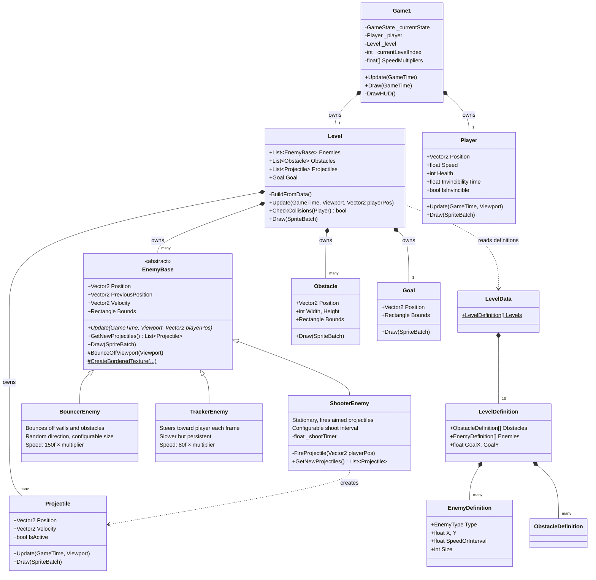
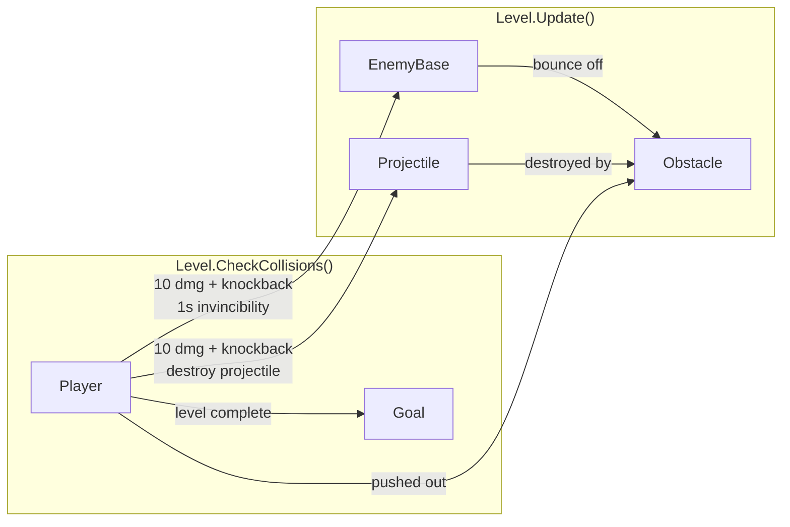
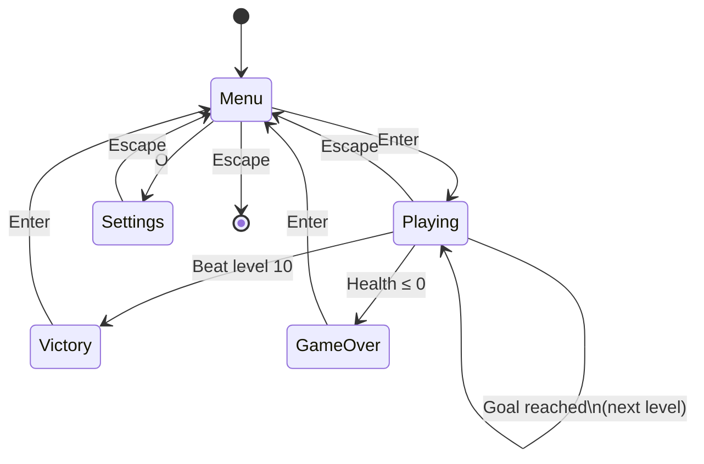
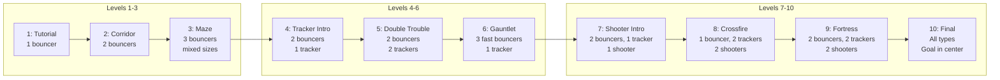

# Architecture Diagram

## Component Relationships

```mermaid
classDiagram
    direction TB

    class Game1 {
        -GameState _currentState
        -Player _player
        -Level _level
        -int _currentLevelIndex
        -float[] SpeedMultipliers
        +Update(GameTime)
        +Draw(GameTime)
        -DrawHUD()
    }

    class Level {
        +List~EnemyBase~ Enemies
        +List~Obstacle~ Obstacles
        +List~Projectile~ Projectiles
        +Goal Goal
        -BuildFromData()
        +Update(GameTime, Viewport, Vector2 playerPos)
        +CheckCollisions(Player) bool
        +Draw(SpriteBatch)
    }

    class LevelData {
        +LevelDefinition[] Levels$
    }
    class LevelDefinition {
        +ObstacleDefinition[] Obstacles
        +EnemyDefinition[] Enemies
        +float GoalX, GoalY
    }
    class EnemyDefinition {
        +EnemyType Type
        +float X, Y
        +float SpeedOrInterval
        +int Size
    }

    class EnemyBase {
        <<abstract>>
        +Vector2 Position
        +Vector2 PreviousPosition
        +Vector2 Velocity
        +Rectangle Bounds
        +Update(GameTime, Viewport, Vector2 playerPos)*
        +GetNewProjectiles() List~Projectile~
        +Draw(SpriteBatch)
        #BounceOffViewport(Viewport)
        #CreateBorderedTexture(...)$
    }

    class BouncerEnemy {
        Bounces off walls and obstacles
        Random direction, configurable size
        Speed: 150f × multiplier
    }
    class TrackerEnemy {
        Steers toward player each frame
        Slower but persistent
        Speed: 80f × multiplier
    }
    class ShooterEnemy {
        Stationary, fires aimed projectiles
        Configurable shoot interval
        -float _shootTimer
        -FireProjectile(Vector2 playerPos)
        +GetNewProjectiles() List~Projectile~
    }

    class Player {
        +Vector2 Position
        +float Speed
        +int Health
        +float InvincibilityTime
        +bool IsInvincible
        +Update(GameTime, Viewport)
        +Draw(SpriteBatch)
    }

    class Projectile {
        +Vector2 Position
        +Vector2 Velocity
        +bool IsActive
        +Update(GameTime, Viewport)
        +Draw(SpriteBatch)
    }

    class Obstacle {
        +Vector2 Position
        +int Width, Height
        +Rectangle Bounds
        +Draw(SpriteBatch)
    }

    class Goal {
        +Vector2 Position
        +Rectangle Bounds
        +Draw(SpriteBatch)
    }

    Game1 *-- "1" Player : owns
    Game1 *-- "1" Level : owns
    Level *-- "many" EnemyBase : owns
    Level *-- "many" Obstacle : owns
    Level *-- "many" Projectile : owns
    Level *-- "1" Goal : owns
    Level ..> LevelData : reads definitions
    LevelData *-- "10" LevelDefinition
    LevelDefinition *-- "many" EnemyDefinition
    LevelDefinition *-- "many" ObstacleDefinition

    EnemyBase <|-- BouncerEnemy
    EnemyBase <|-- TrackerEnemy
    EnemyBase <|-- ShooterEnemy
    ShooterEnemy ..> Projectile : creates
```

## Collision Map

```mermaid
flowchart LR
    subgraph "Level.Update()"
        E[EnemyBase] -- "bounce off" --> O[Obstacle]
        P2[Projectile] -- "destroyed by" --> O
    end

    subgraph "Level.CheckCollisions()"
        PL[Player] -- "pushed out" --> O
        PL -- "10 dmg + knockback\n1s invincibility" --> E
        PL -- "10 dmg + knockback\ndestroy projectile" --> P2
        PL -- "level complete" --> G[Goal]
    end
```

## Game State Flow

```mermaid
stateDiagram-v2
    [*] --> Menu
    Menu --> Playing : Enter
    Menu --> Settings : O
    Menu --> [*] : Escape

    Settings --> Menu : Escape

    Playing --> Menu : Escape
    Playing --> Playing : Goal reached\n(next level)
    Playing --> Victory : Beat level 10
    Playing --> GameOver : Health ≤ 0

    GameOver --> Menu : Enter
    Victory --> Menu : Enter
```

## Level Progression

```mermaid
flowchart LR
    subgraph "Levels 1-3"
        L1["1: Tutorial\n1 bouncer"]
        L2["2: Corridor\n2 bouncers"]
        L3["3: Maze\n3 bouncers\nmixed sizes"]
    end

    subgraph "Levels 4-6"
        L4["4: Tracker Intro\n2 bouncers\n1 tracker"]
        L5["5: Double Trouble\n2 bouncers\n2 trackers"]
        L6["6: Gauntlet\n3 fast bouncers\n1 tracker"]
    end

    subgraph "Levels 7-10"
        L7["7: Shooter Intro\n2 bouncers, 1 tracker\n1 shooter"]
        L8["8: Crossfire\n1 bouncer, 2 trackers\n2 shooters"]
        L9["9: Fortress\n2 bouncers, 2 trackers\n2 shooters"]
        L10["10: Final\nAll types\nGoal in center"]
    end

    L1 --> L2 --> L3 --> L4 --> L5 --> L6 --> L7 --> L8 --> L9 --> L10
```
