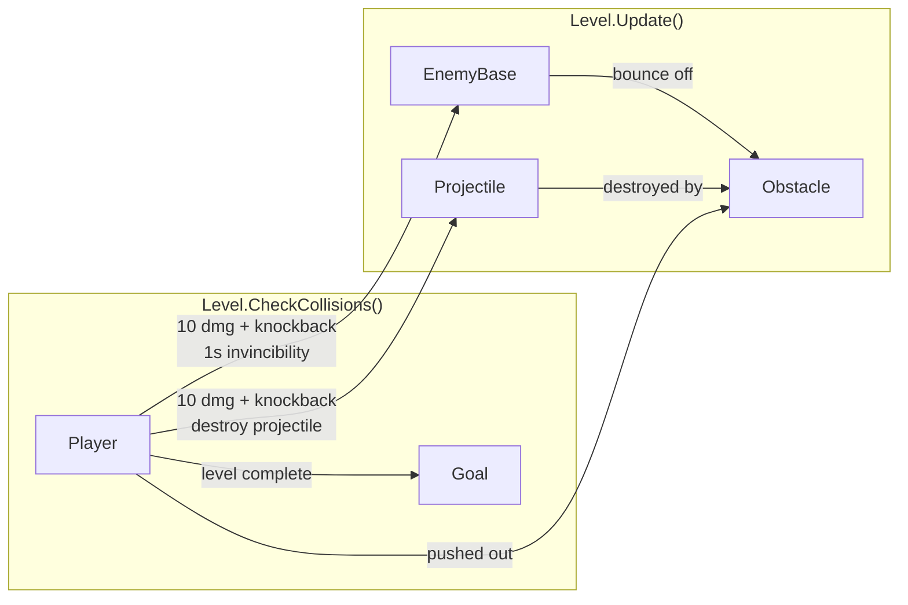
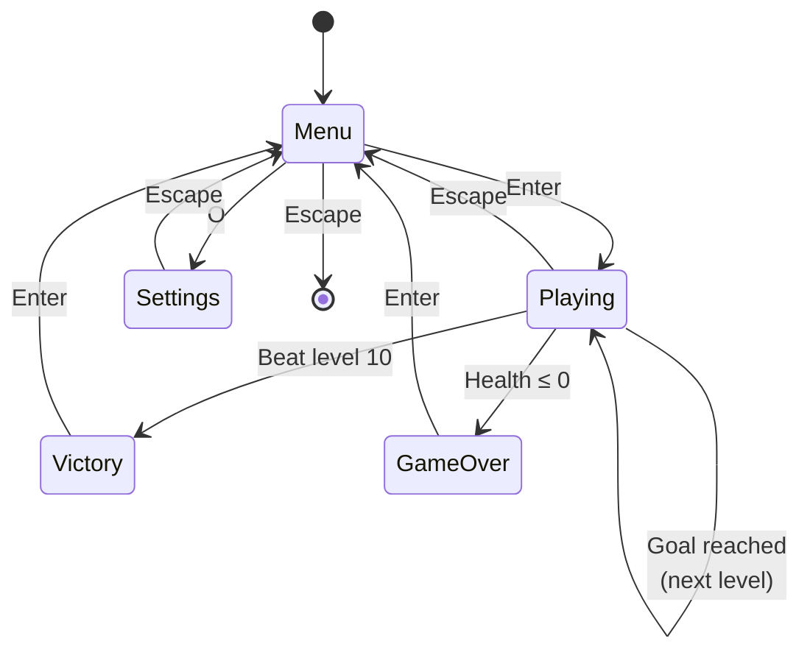
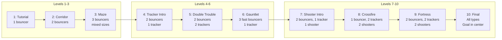
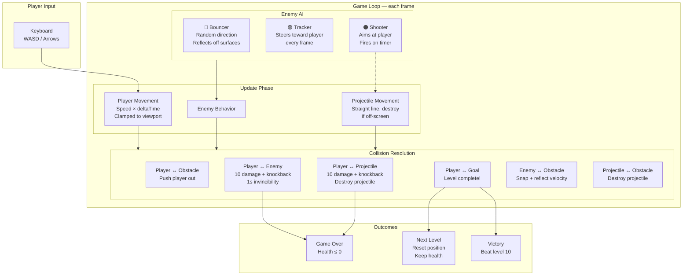
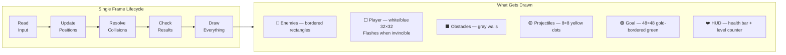
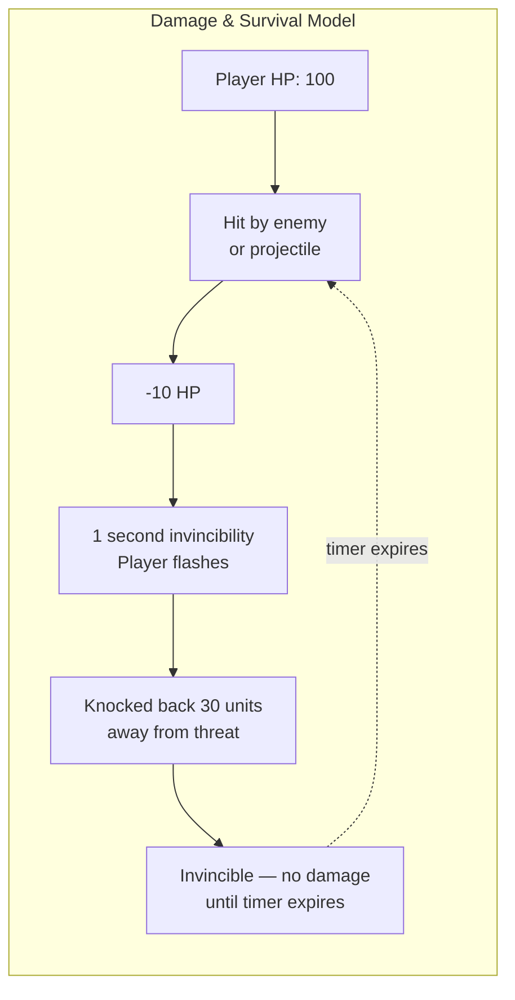

# Architecture Diagram

## Component Relationships

## Collision Map

## Game State Flow

## Level Progression

## Conceptual Game Model

How the game works from a player's perspective, and how the systems interact each frame.

